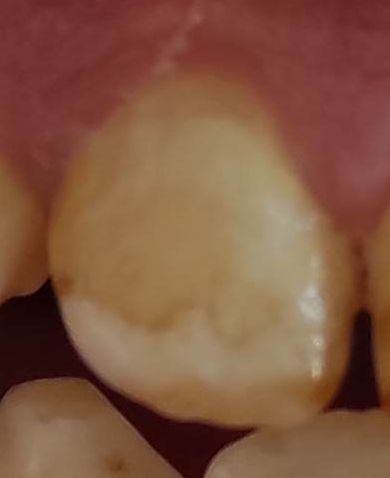
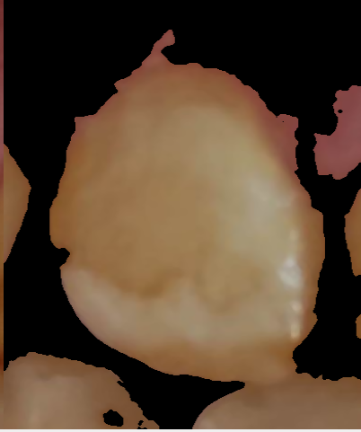

# Dental Image Processing Tool

An advanced image processing tool for analyzing and segmenting dental images. This project uses techniques such as grayscale conversion, Otsu thresholding, contour detection, and histogram equalization to enhance image quality and isolate tooth contours. Ideal for dental diagnostics, research, and machine learning tasks.

## Features
- Grayscale conversion of images
- Otsu thresholding for automatic threshold selection
- Contour detection and segmentation of teeth
- Noise reduction through median blurring
- Image stacking for before and after comparison

## Project Overview

This project processes dental images by isolating tooth contours and enhancing image quality through advanced image processing techniques. The goal is to improve image clarity for further analysis, segmentation, and use in dental diagnostics.

### Sample Image Workflow

| Original Image | Processed Image |
| -------------- | --------------- |
|  |  |

## Installation

1. Clone the repository:
    ```bash
    git clone https://github.com/MehmetKUTAN/ToothSegmentationTool.git
    ```

2. Navigate to the project directory:
    ```bash
    cd ToothSegmentationTool
    ```

3. Install the required Python dependencies:
    ```bash
    pip install -r requirements.txt
    ```

## Usage

1. Place your dental images in the `images/` folder in formats like `.jpg`, `.jpeg`, `.png`, or `.gif`.

2. Run the image processing script:
    ```bash
    python detection_teeth.py
    ```

3. The script will process the images and display the original and processed versions stacked horizontally for comparison.

### Example Command

```bash
python detection_teeth.py
